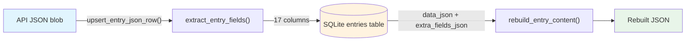
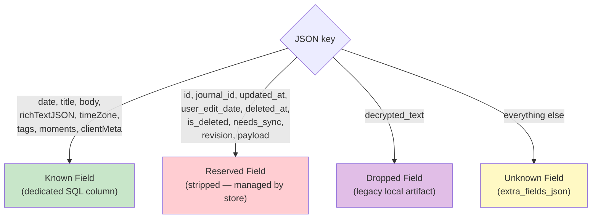
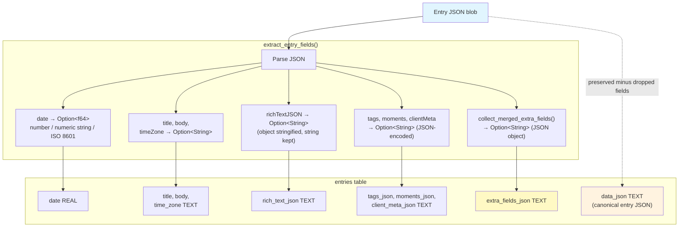
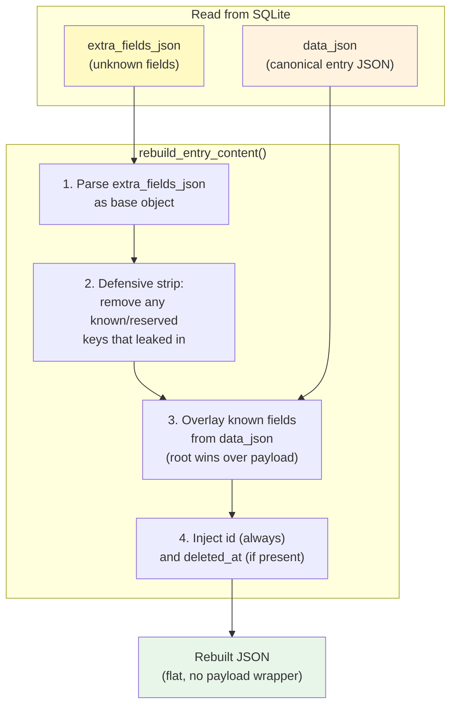
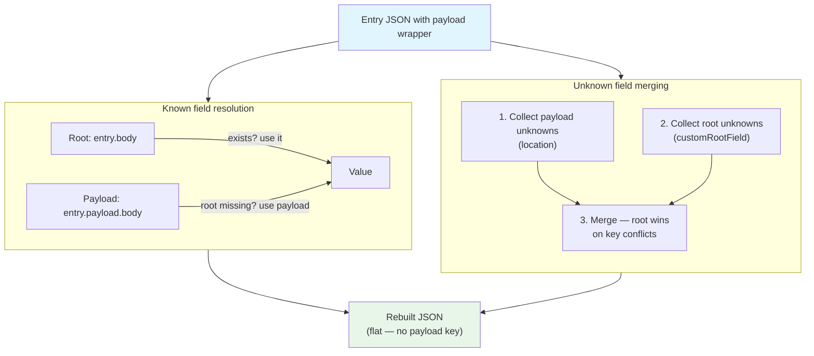
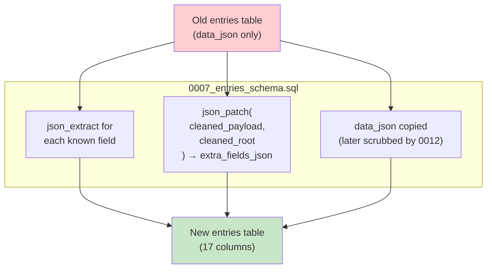

# Entry SQL Schema: The Hybrid Storage Model

This document explains how Day One entries are stored in SQLite using a hybrid SQL-JSON model — how JSON blobs from the API are decomposed into queryable SQL columns, and how they're reassembled when sent back.

---

## Table of Contents

1. [Why a Hybrid Model](#why-a-hybrid-model)
2. [The Round-Trip at a Glance](#the-round-trip-at-a-glance)
3. [Field Categories](#field-categories)
4. [Decomposition: JSON to SQL](#decomposition-json-to-sql)
5. [The SQL Schema](#the-sql-schema)
6. [Reconstruction: SQL to JSON](#reconstruction-sql-to-json)
7. [Payload Wrapper Handling](#payload-wrapper-handling)
8. [Migration (0007)](#migration-0007)

---

## Why a Hybrid Model

The Day One API returns entries as large JSON blobs. Storing them as-is in a single `data_json` column works, but makes common queries (filter by date, search by title, list by journal) require full JSON parsing at query time.

The hybrid model extracts the most commonly queried fields into dedicated SQL columns for fast indexing and filtering, while preserving the full blob and any unknown/future fields for lossless round-tripping. If the API adds a new field next week, the CLI won't lose it — it lands in `extra_fields_json` and survives the round-trip untouched.

---

## The Round-Trip at a Glance



Two columns carry the data needed for reconstruction:
- **`data_json`** — the CLI's canonical entry JSON representation, preserving API fields except explicitly dropped local-only synthetic fields
- **`extra_fields_json`** — unknown/future fields merged from root and payload

The other 15 columns are extracted for queryability but are **not used during reconstruction** — `rebuild_entry_content()` reads known fields back from `data_json` to avoid any type coercion issues from the SQL round-trip.

---

## Field Categories

Every key in an entry JSON blob falls into one of three categories:



| Category | Count | Where it goes | Round-trips? |
|----------|-------|---------------|--------------|
| **Known** | 8 | Dedicated SQL column + `data_json` | Yes — read back from `data_json` |
| **Reserved** | 9 | SQL metadata columns (id, journal_id, etc.) | Partially — `id` and `deleted_at` are re-injected |
| **Dropped** | 1 | Ignored | No — intentionally discarded |
| **Unknown** | any | `extra_fields_json` | Yes — merged back as the base object |

### Known Fields (8)

Defined in `KNOWN_ENTRY_FIELD_KEYS` (`src/store/entries/json.rs`):

| JSON key | SQL column | SQL type | Notes |
|----------|-----------|----------|-------|
| `date` | `date` | REAL | Epoch ms; accepts number, numeric string, or ISO 8601 |
| `title` | `title` | TEXT | |
| `body` | `body` | TEXT | |
| `richTextJSON` | `rich_text_json` | TEXT | Stored as JSON string; accepts object or string |
| `timeZone` | `time_zone` | TEXT | |
| `tags` | `tags_json` | TEXT | JSON array stored as string |
| `moments` | `moments_json` | TEXT | JSON array stored as string |
| `clientMeta` | `client_meta_json` | TEXT | JSON object stored as string |

### Reserved Fields (9)

Defined in `RESERVED_ENTRY_FIELD_KEYS` (`src/store/entries/json.rs`):

| JSON key | Managed by | Re-injected on rebuild? |
|----------|-----------|------------------------|
| `id` | Store (primary key) | Yes — always |
| `journal_id` | Store (foreign key) | No |
| `updated_at` | Store (sync metadata) | No |
| `user_edit_date` | Store (sync metadata) | No |
| `deleted_at` | Store (soft-delete) | Yes — if present |
| `is_deleted` | Store (derived flag) | No |
| `needs_sync` | Store (outbox flag) | No |
| `revision` | Store (sync metadata) | No |
| `payload` | Flattened during decomposition | No |

### Dropped Fields (1)

Defined in `DROPPED_ENTRY_FIELD_KEYS` (`src/store/entries/json.rs`):

| JSON key | Why dropped |
|----------|-------------|
| `decrypted_text` | Historical CLI-only fallback for decrypted D1 payloads that were not valid JSON. New sync code surfaces these parse failures as errors instead of storing synthetic text. |

---

## Decomposition: JSON to SQL

When an entry is upserted, `extract_entry_fields()` splits the JSON blob into typed fields:



Key behaviors:
- All known fields use a **two-level lookup**: check root first, then `$.payload`
- `date` accepts three formats: JSON number, numeric string (`"1700000000000"`), or ISO 8601 string — all stored as epoch ms (REAL)
- Explicit JSON `null` for `tags`, `moments`, `clientMeta`, `timeZone`, and `richTextJSON` maps to SQL NULL (not the string `"null"`)
- Entry JSON is preserved in `data_json` for compatibility, except keys listed in `DROPPED_ENTRY_FIELD_KEYS` (currently only the CLI-synthetic `decrypted_text` fallback)

---

## The SQL Schema

```sql
CREATE TABLE entries (
  id                TEXT PRIMARY KEY,
  journal_id        TEXT NOT NULL,

  -- Timestamps
  date              REAL,           -- epoch ms
  user_edit_date    TEXT,           -- ISO 8601
  updated_at        TEXT,           -- server timestamp
  deleted_at        TEXT,           -- ISO 8601; non-null = soft-deleted
  is_deleted        INTEGER NOT NULL DEFAULT 0,

  -- Content (extracted for queryability)
  title             TEXT,
  body              TEXT,
  decrypted_text    TEXT,           -- legacy unused column; new writes leave this NULL
  rich_text_json    TEXT,           -- JSON string
  time_zone         TEXT,

  -- Metadata (JSON-encoded)
  tags_json         TEXT,           -- JSON array
  moments_json      TEXT,           -- JSON array
  client_meta_json  TEXT,           -- JSON object
  extra_fields_json TEXT,           -- merged unknown fields

  -- Canonical entry JSON backup
  data_json         TEXT NOT NULL   -- API fields minus explicitly dropped local-only fields
);
```

Indexes:
- `idx_entries_journal_id` — filter by journal
- `idx_entries_date` — sort/filter by date (partial: non-null only)
- `idx_entries_journal_date` — journal + date descending (partial: non-deleted)
- `idx_entries_journal_edit_date` — journal + edit date descending (partial: non-deleted)
- `idx_entries_deleted` — soft-delete queries

---

## Reconstruction: SQL to JSON

When an entry needs to be sent back to the API, `rebuild_entry_content()` reassembles it:



The reconstruction reads known field values from `data_json` (not from individual SQL columns) to avoid any type coercion from the SQL round-trip. The `extra_fields_json` provides unknown fields as the base, and known fields are overlaid on top.

If `extra_fields_json` is empty or NULL, the function falls back to re-extracting unknown fields from `data_json` using `collect_merged_extra_fields()`.

---

## Payload Wrapper Handling

Some entries arrive from the API wrapped in a `payload` key:

```json
{
  "id": "abc",
  "journal_id": "j1",
  "payload": {
    "body": "Hello from payload",
    "date": 1700000000000,
    "location": { "lat": 37.7, "lon": -122.4 }
  },
  "customRootField": "only at root"
}
```

Both decomposition and reconstruction handle this with a **root-wins** precedence:



The `payload` key itself is always stripped from the output. After reconstruction, the entry is a flat JSON object regardless of whether it originally had a payload wrapper.

For the example above, the rebuilt JSON would be:

```json
{
  "id": "abc",
  "body": "Hello from payload",
  "date": 1700000000000,
  "location": { "lat": 37.7, "lon": -122.4 },
  "customRootField": "only at root"
}
```

---

## Migration (0007)

Migration `0007_entries_schema.sql` converts existing entries from the old schema (only `id`, `journal_id`, `user_edit_date`, `updated_at`, `deleted_at`, `is_deleted`, `data_json`) to the new hybrid schema.

The migration:

1. **Creates `entries_new`** with the full column set
2. **Extracts known fields** from `data_json` using `json_extract` with COALESCE (root, then payload)
3. **Merges unknown fields** using `json_patch`:
   - Strip known + reserved keys from `$.payload` → left side
   - Strip known + reserved keys + `$.payload` from root → right side
   - `json_patch(left, right)` merges them, with root (right) winning on conflicts
4. **Swaps tables**: `DROP TABLE entries` → `ALTER TABLE entries_new RENAME TO entries`
5. **Creates indexes** for common query patterns

The migration is guarded in Rust (`src/store/sqlite.rs`) to only run when the `extra_fields_json` column doesn't yet exist, preventing the expensive table copy on every startup.



---

## Migrations (0012, 0014)

Migration `0012_drop_decrypted_text.sql` removes the historical CLI-only `decrypted_text` fallback from existing entry rows. Migration `0014_rescrub_decrypted_text.sql` repeats the scrub for databases that already recorded `0012` before the revert window could write the fallback again.

- sets the legacy `entries.decrypted_text` column to NULL
- removes root `$.decrypted_text` from `data_json`
- removes `$.payload.decrypted_text` from `data_json`
- removes stale `decrypted_text` from `extra_fields_json`

This is intentionally narrow: `data_json` still preserves API fields, but no longer preserves this local synthetic fallback that was created from lossy decoded bytes after decrypted D1 payload JSON parsing failed.

---

## Source Code References

| Component | File | Key functions |
|-----------|------|---------------|
| Field constants | `src/store/entries/json.rs` | `KNOWN_ENTRY_FIELD_KEYS`, `RESERVED_ENTRY_FIELD_KEYS`, `DROPPED_ENTRY_FIELD_KEYS` |
| Decomposition | `src/store/entries/json.rs` | `prepare_entry_data_json()`, `extract_entry_fields()` |
| Unknown field extraction | `src/store/entries/json.rs:43-68` | `collect_merged_extra_fields()` |
| Reconstruction | `src/store/entries/json.rs:106-132` | `rebuild_entry_content()` |
| Upsert (no edit date) | `src/store/entries/json.rs:254-309` | `upsert_entry_json_row()` |
| Upsert (with edit date) | `src/store/entries/json.rs:311-369` | `upsert_entry_json_row_with_edit_date()` |
| Read for rebuild | `src/store/entries/json.rs:240-252` | `get_entry_json_row_with_extra_fields()` |
| SQL migration | `src/store/migrations/0007_entries_schema.sql` | Hybrid entry schema migration |
| Dropped-field cleanup migrations | `src/store/migrations/0012_drop_decrypted_text.sql`, `src/store/migrations/0014_rescrub_decrypted_text.sql` | Scrub legacy `decrypted_text` storage |
| Migration guard | `src/store/sqlite.rs` | `initialize()` |
| Round-trip tests | `src/store/sqlite/tests/part_05.rs` | 18+ test cases |
